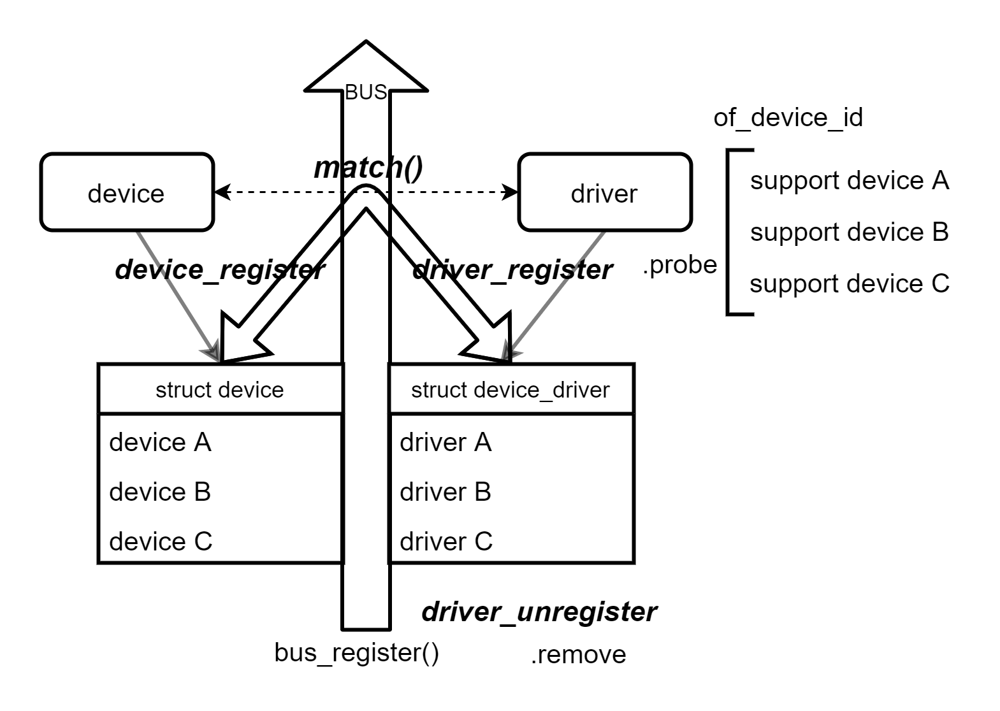

## Linux设备模型



## Linux sysfs
```
每条总线bus/pci在总线目录中都有一个目录，以及两个默认目录（devices, drivers）
/sys/bus/pci/
|-- devices  #在该类型总线上的注册的每个设备生成指向物理层次结构对应的符号链接
|   |-- 00:00.0 -> ../../../root/pci0/00:00.0
|   |-- 00:01.0 -> ../../../root/pci0/00:01.0
|   `-- 00:02.0 -> ../../../root/pci0/00:02.0
`-- drivers  #在该类型总线上注册的驱动程序也会生成对应目录
    |-- Intel ICH
    |-- Intel ICH Joystick
    |-- agpgart
    `-- e100
```

## Example  ==TODO==


