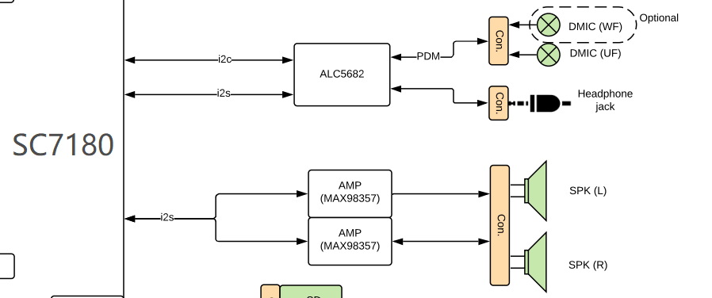

# CoachZ Sound Driver

## Question

- [x]  Which drivers do we need?
- [x]  How to register a driver?
- [x]  How to register a device?
- [x]  How probe work?
- [x]  Where platform_device and platform_data come from?
- [ ]  How to link codec and CPU in Machine driver?
- [ ]  How to write probe，remove，shutdown，suspend？
- [ ]  How to upstream a patch?

## Hardware

CPU: sc7180

Codec: adau7002(ALC5682)

DAI: I2S

Amplifier: max98357a



**Answer**: What drivers do we need?


## Software

DTS: [arch/arm64/boot/dts/qcom/sc7180-trogdor-coachz-r3.dts](https://elixir.bootlin.com/linux/v5.18-rc5/source/arch/arm64/boot/dts/qcom/sc7180-trogdor-coachz-r3.dts)

Machine driver: [sound/soc/qcom/sc7180.c](https://elixir.bootlin.com/linux/v5.18-rc5/source/sound/soc/qcom/sc7180.c)

CPU driver: [sound/soc/qcom/lpass-sc7180.c](https://elixir.bootlin.com/linux/v5.18-rc5/source/sound/soc/qcom/lpass-sc7180.c)

Codec driver: [sound/soc/codecs/adau7002.c](https://elixir.bootlin.com/linux/v5.18-rc5/source/sound/soc/codecs/adau7002.c)

Kernel version: ChromiumOS: v5.4,  Upstream: v5.18


### DTS

```c

```

#### platform_device & platform_data

platform device specific data while probing comes from the platform setup code or from **device tree**. you can find the related code in **arch/arm/borad/device** files **struct platform_device** embedded with **platform_data structure** where you will pass the platform related data to the drivers.

in modern kernels platform data is passed to device drivers through device tree. device tree can be found in **/arch/arm/boot/dts/your_device**

**Answer**: **[Where platform device & platform data come from?](https://stackoverflow.com/questions/37110495/where-the-probe-functions-argument-comes-from)**


### Machine driver

主要负责Codec，Platform，DAI之间的耦合, Machine 驱动的设备初始化代码无非就是选择合适 Platform 和 Codec 以及 dai，用他们填充以上几个数据结构，然后注册Platform设备即可,当然还要实现连接 Platform 和 Codec的dai_link对应的 ops 实现.

```c
static const struct of_device_id sc7180_snd_device_id[]  = {
	{.compatible = "google,sc7180-trogdor"},
	{.compatible = "google,sc7180-coachz"},
	{},
};
MODULE_DEVICE_TABLE(of, sc7180_snd_device_id); //1. 将支持的设备ID广播到用户空间

static struct platform_driver [sc7180_snd_driver](https://elixir.bootlin.com/linux/v5.18-rc5/source/sound/soc/qcom/sc7180.c#L394) = {
	.probe = sc7180_snd_platform_probe,
	.driver = {
		.name = "msm-snd-sc7180",
		.of_match_table = sc7180_snd_device_id,
		.pm = &snd_soc_pm_ops,
	},
};
module_platform_driver(sc7180_snd_driver); //2. 注册driver到总线, probe，创建device node
```

解析：**`[module_platform_driver](https://elixir.bootlin.com/linux/v5.18-rc5/source/sound/soc/qcom/sc7180.c#L402)**(**[sc7180_snd_driver](https://elixir.bootlin.com/linux/v5.18-rc5/C/ident/sc7180_snd_driver)**);`

1. **`[module_driver](https://elixir.bootlin.com/linux/v5.18-rc5/source/include/linux/device/driver.h#L259)**(__platform_driver, **[platform_driver_register](https://elixir.bootlin.com/linux/v5.18-rc5/C/ident/platform_driver_register)**,`**`[platform_driver_unregister](https://elixir.bootlin.com/linux/v5.18-rc5/C/ident/platform_driver_unregister)**)`
2. **`[__platform_driver_register](https://elixir.bootlin.com/linux/v5.18-rc5/source/include/linux/platform_device.h#L223)**(struct **[platform_driver](https://elixir.bootlin.com/linux/v5.18-rc5/C/ident/platform_driver)** *,``struct **[module](https://elixir.bootlin.com/linux/v5.18-rc5/C/ident/module)** ***[owner](https://elixir.bootlin.com/linux/v5.18-rc5/C/ident/owner)**)`
3. **`[driver_register](https://elixir.bootlin.com/linux/v5.18-rc5/source/drivers/base/platform.c#L863)**(&**[drv](https://elixir.bootlin.com/linux/v5.18-rc5/C/ident/drv)**->driver);`
4. **`[bus_add_driver](https://elixir.bootlin.com/linux/v5.18-rc5/source/drivers/base/driver.c#L171)**(**[drv](https://elixir.bootlin.com/linux/v5.18-rc5/C/ident/drv)**);`
5. **`[driver_attach](https://elixir.bootlin.com/linux/v5.18-rc5/source/drivers/base/bus.c#L618)**(**[drv](https://elixir.bootlin.com/linux/v5.18-rc5/C/ident/drv)**);`// probe will be called in this function
**`[module_add_driver](https://elixir.bootlin.com/linux/v5.18-rc5/source/drivers/base/bus.c#L622)**(**[drv](https://elixir.bootlin.com/linux/v5.18-rc5/C/ident/drv)**->**[owner](https://elixir.bootlin.com/linux/v5.18-rc5/C/ident/owner)**, **[drv](https://elixir.bootlin.com/linux/v5.18-rc5/C/ident/drv)**);`
**`[driver_create_file](https://elixir.bootlin.com/linux/v5.18-rc5/source/drivers/base/bus.c#L624)**(**[drv](https://elixir.bootlin.com/linux/v5.18-rc5/C/ident/drv)**, &driver_attr_uevent);`
**`[driver_add_groups](https://elixir.bootlin.com/linux/v5.18-rc5/C/ident/driver_add_groups)**(**[drv](https://elixir.bootlin.com/linux/v5.18-rc5/C/ident/drv)**, **[bus](https://elixir.bootlin.com/linux/v5.18-rc5/C/ident/bus)**->**[drv_groups](https://elixir.bootlin.com/linux/v5.18-rc5/C/ident/drv_groups)**);`
**`[add_bind_files](https://elixir.bootlin.com/linux/v5.18-rc5/C/ident/add_bind_files)**(**[drv](https://elixir.bootlin.com/linux/v5.18-rc5/C/ident/drv)**);`
6. **`[bus_for_each_dev](https://elixir.bootlin.com/linux/v5.18-rc5/source/drivers/base/dd.c#L1158)**(**[drv](https://elixir.bootlin.com/linux/v5.18-rc5/C/ident/drv)**->**[bus](https://elixir.bootlin.com/linux/v5.18-rc5/C/ident/bus)**, NULL, **[drv](https://elixir.bootlin.com/linux/v5.18-rc5/C/ident/drv)**, **[__driver_attach](https://elixir.bootlin.com/linux/v5.18-rc5/C/ident/__driver_attach)**);`
**`[driver_probe_device](https://elixir.bootlin.com/linux/v5.18-rc5/source/drivers/base/dd.c#L776)**(**[drv](https://elixir.bootlin.com/linux/v5.18-rc5/C/ident/drv)**, dev);`
**`[really_probe](https://elixir.bootlin.com/linux/v5.18-rc5/source/drivers/base/dd.c#L752)**(dev, **[drv](https://elixir.bootlin.com/linux/v5.18-rc5/C/ident/drv)**);`
**`[call_driver_probe](https://elixir.bootlin.com/linux/v5.18-rc5/source/drivers/base/dd.c#L621)**(dev, **[drv](https://elixir.bootlin.com/linux/v5.18-rc5/C/ident/drv)**);`
**`[drv](https://elixir.bootlin.com/linux/v5.18-rc5/C/ident/drv)**->**[probe](https://elixir.bootlin.com/linux/v5.18-rc5/source/drivers/base/dd.c#L542)**(dev);`

**Answer**:  **[Who calls "probe" function in driver code?](https://stackoverflow.com/questions/22722520/who-calls-probe-function-in-driver-code)**

解析：**`[sc7180_snd_platform_probe](https://elixir.bootlin.com/linux/v5.18-rc5/source/sound/soc/qcom/sc7180.c#L395)`**

1. **`[qcom_snd_parse_of](https://elixir.bootlin.com/linux/v5.18-rc5/source/sound/soc/qcom/sc7180.c#L370)**(card);`
**`[devm_snd_soc_register_card](https://elixir.bootlin.com/linux/v5.18-rc5/source/sound/soc/qcom/sc7180.c#L384)**(dev, card);`
2. **`[snd_soc_register_card](https://elixir.bootlin.com/linux/v5.18-rc5/source/sound/soc/soc-devres.c#L111)**(card);`
**`[devres_add](https://elixir.bootlin.com/linux/v5.18-rc5/source/sound/soc/soc-devres.c#L114)**(dev, ptr);`
3. **`[snd_soc_bind_card](https://elixir.bootlin.com/linux/v5.18-rc5/source/sound/soc/soc-core.c#L2319)**(card);`
4. **`[snd_card_new](https://elixir.bootlin.com/linux/v5.18-rc5/C/ident/snd_card_new)**(card->dev, **[SNDRV_DEFAULT_IDX1](https://elixir.bootlin.com/linux/v5.18-rc5/C/ident/SNDRV_DEFAULT_IDX1)**, **[SNDRV_DEFAULT_STR1](https://elixir.bootlin.com/linux/v5.18-rc5/C/ident/SNDRV_DEFAULT_STR1)**,`
**`[soc_init_card_debugfs](https://elixir.bootlin.com/linux/v5.18-rc5/C/ident/soc_init_card_debugfs)**(card);`
**`[snd_soc_dapm_new_controls](https://elixir.bootlin.com/linux/v5.18-rc5/C/ident/snd_soc_dapm_new_controls)**(&card->**[dapm](https://elixir.bootlin.com/linux/v5.18-rc5/C/ident/dapm)**, card->**[dapm_widgets](https://elixir.bootlin.com/linux/v5.18-rc5/C/ident/dapm_widgets)**,`
**`[snd_soc_card_probe](https://elixir.bootlin.com/linux/v5.18-rc5/C/ident/snd_soc_card_probe)**(card);`
**`[soc_probe_link_components](https://elixir.bootlin.com/linux/v5.18-rc5/C/ident/soc_probe_link_components)**(card);`
**`[soc_probe_link_dais](https://elixir.bootlin.com/linux/v5.18-rc5/source/sound/soc/soc-core.c#L2008)**(card);`

### Codec driver

### CPU driver